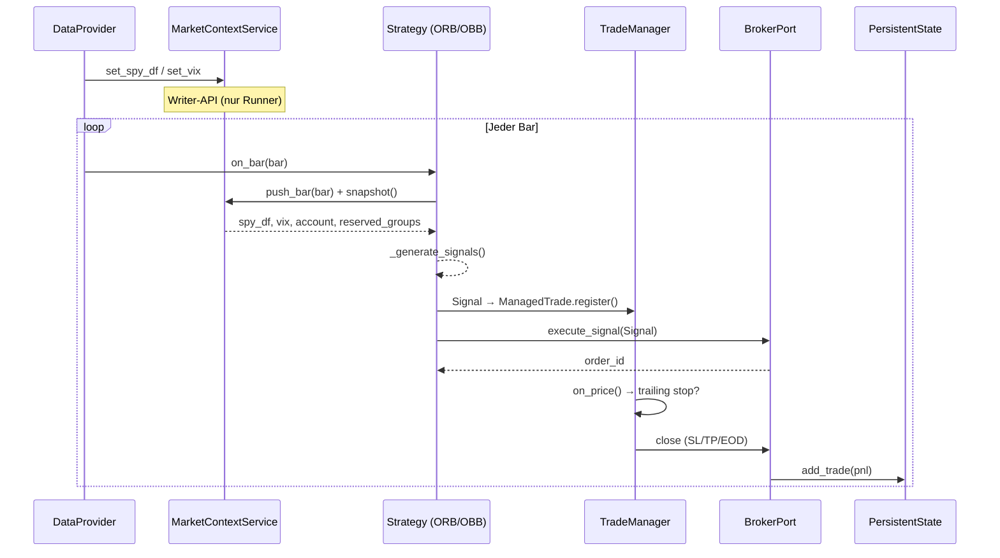
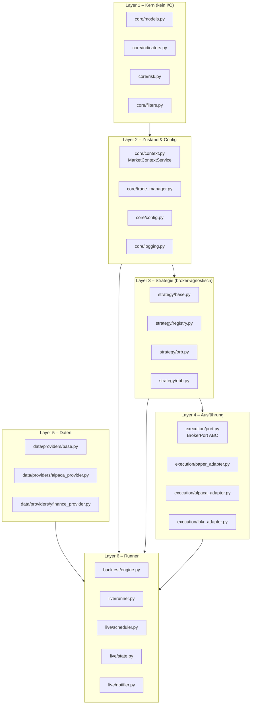
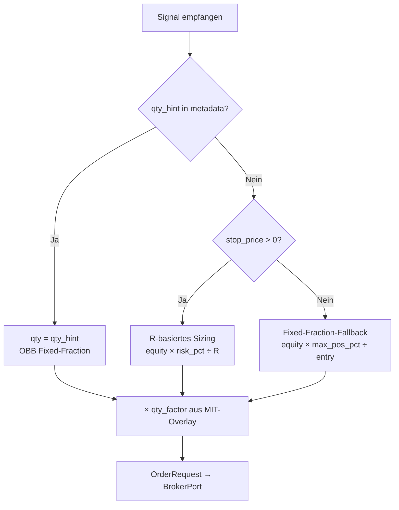

# Architektur

## Designprinzipien

| Prinzip | Ausprägung |
|---|---|
| **Broker-Agnostik** | Strategien importieren keinen Broker-Code |
| **No-Duplicate-Logic** | ATR, Stops, Kelly leben exakt einmal in `core/` |
| **Gleiche Klasse Backtest/Live** | `ORBStrategy` wird unverändert in beiden Modi genutzt |
| **Dependency Injection** | Cross-Symbol-Kontext (SPY, VIX, Account) via `MarketContextService` |
| **Async-First** | Alle Broker-Calls sind `async`; sync SDKs werden via `run_in_executor` gewrapped |
| **Pydantic v2 Config** | Typsichere Konfiguration mit Env-Variable-Merge |

---

## Vollständiger Daten-Flow



---

## Schichtenmodell



---

## MarketContextService (DI-Hub)

Der `MarketContextService` ist der zentrale Shared-State zwischen Runner und Strategien.
Strategien dürfen **nur lesen** – schreiben darf ausschließlich der Runner/Engine.

```mermaid
graph LR
    subgraph Writer["Writer (Runner/Engine)"]
        W1[set_now]
        W2[update_account]
        W3[set_spy_df]
        W4[set_vix]
        W5[set_open_symbols]
        W6[reserve_group]
        W7[push_bar]
    end
    subgraph Service["MarketContextService"]
        S[(State)]
    end
    subgraph Reader["Reader (Strategy)"]
        R1[snapshot]
        R2[account]
        R3[spy_df]
        R4[vix]
        R5[open_symbols]
        R6[reserved_groups]
        R7[bars(symbol)]
    end

    Writer --> Service --> Reader
```

**Singleton-Zugriff:**
```python
from core.context import get_context_service, set_context_service, reset_context_service

# Runner setzt einmal:
set_context_service(MarketContextService(initial_capital=100_000))

# Strategie liest:
ctx = get_context_service()
spy = ctx.spy_df
```

---

## Signal-Vertrag

Strategien kommunizieren ausschließlich über `Signal`-Objekte. Keine direkten Broker-Calls.

```python
@dataclass(frozen=True)
class Signal:
    strategy_id: str       # "orb" | "obb"
    symbol:      str
    direction:   int       # +1 Long, -1 Short, 0 Flat/Exit
    strength:    float     # 0.0–1.0 (beeinflusst Sizing)
    stop_price:  float     # 0.0 bei OBB (kein SL)
    target_price: Optional[float]
    timestamp:   datetime
    metadata:    dict      # entry_price, orb_high/low, qty_hint, exit_next_open, …
```

**Metadata-Keys nach Strategie:**

=== "ORB"
    | Key | Typ | Bedeutung |
    |---|---|---|
    | `entry_price` | float | Aktueller Kurs beim Signal |
    | `orb_high` / `orb_low` / `orb_range` | float | Opening-Range-Levels |
    | `volume_ratio` | float | Rel. Volume vs. Time-of-Day-MA |
    | `qty_factor` | float | MIT-Kelly-Skalierungsfaktor (0.25–1.0) |
    | `reserve_group` | str | MIT-Korrelationsgruppe (z.B. "semi_ai") |
    | `reason` | str | Menschenlesbarer Signal-Text |

=== "OBB"
    | Key | Typ | Bedeutung |
    |---|---|---|
    | `entry_price` | float | Schlusskurs des Signal-Bars |
    | `lookback_high` / `lookback_low` | float | 50-Bar-Extrema |
    | `qty_hint` | int | Berechnete Stückzahl (Fixed-Fraction) |
    | `exit_next_open` | bool | `True` → TradeManager schließt am nächsten Open |
    | `reason` | str | Menschenlesbarer Signal-Text |

---

## Zwei Sizing-Paradigmen



### Kontostandquelle und Equity-Flow

Wichtig: **Nicht der DataProvider**, sondern der **BrokerAdapter** liefert
den Kontostand (`equity`, `cash`, `buying_power`).

```mermaid
flowchart LR
    DP[DataProvider<br/>Bars/Quotes] --> RUN[Runner/Engine]
    BRK[BrokerAdapter<br/>get_account] --> RUN
    RUN --> EXE[execute_signal(..., account_equity)]
    EXE --> SIZE[Qty-Berechnung]
```

Praktisch bedeutet das:

| Modus | Kontostand kommt von | Verwendung |
|---|---|---|
| Live (Alpaca/IBKR) | `broker.get_account()` gegen Broker-API | Vor Signal-Execution für Sizing + regelmäßige Context-Synchronisierung |
| Backtest/Paper | `PaperAdapter.get_account()` (intern aus Cash + Positionen) | Pro Bar für Equity-Curve und Sizing |

### ORB vs. OBB (Sizing im Code)

| Strategie | Signal-Inhalt | Sizing-Pfad in `BrokerPort.execute_signal()` |
|---|---|---|
| ORB | setzt `stop_price` + `target_price` | R-basiert via `position_size(equity, risk_pct, entry, stop, ...)` |
| OBB | setzt `qty_hint`, kein SL/TP (`stop_price=0`, `target_price=None`) | `qty_hint` hat Vorrang, kommt aus OBB Fixed-Fraction |

Zusatzdetails:

- `strength` skaliert das effektive Risiko im ORB-Pfad (`risk_pct * strength`).
- `qty_factor` aus Metadata skaliert die Stückzahl am Ende in beiden Pfaden.
- Fehlt Stop **und** `qty_hint`, greift ein Fixed-Fraction-Fallback.

---

## Exit-Verantwortlichkeiten

| Mechanism | Zuständig | Wann |
|---|---|---|
| Bracket-Order SL/TP | Broker (Alpaca/IBKR serverseitig) | Sofort nach Entry |
| Intrabar-Exit (Backtest) | `TradeManager.check_bar_exit()` | Jeder Bar im Backtest |
| Trailing Stop | `TradeManager.on_price()` | Jeder Tick (wenn aktiviert) |
| EOD Flat | `TradeManager.should_eod_close()` | Täglich um `eod_close_time` ET |
| OBB Exit-Next-Open | `BarByBarEngine._handle_exit_next_open()` | Erster Bar des Folgetages |

---

## Async/Sync-Grenze

Alle Broker-SDKs (alpaca-py, ib_insync) sind synchron. Die Grenze wird über `run_in_executor` gezogen:

```python
# Pattern in AlpacaAdapter / IBKRAdapter
loop = asyncio.get_event_loop()
result = await loop.run_in_executor(None, sync_sdk_call)
```

Strategien und der Runner sind vollständig `async` – synchrone Aufrufe verlassen die Event-Loop nie direkt.
