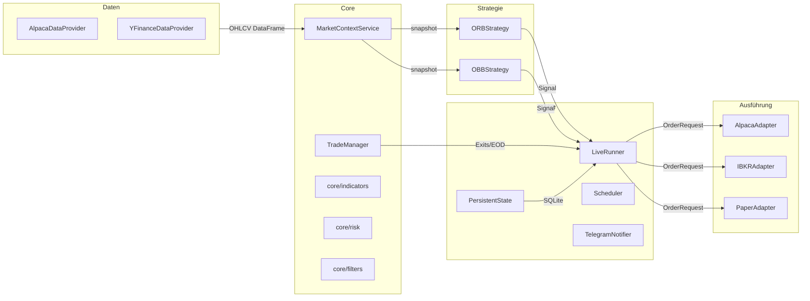

# FluxTrader

**Modulares, produktionsreifes Trading-Bot-Framework für Intraday- und Swing-Strategien.**

FluxTrader migriert und vereinheitlicht die bestehenden ORB- und OBB-Bots in eine saubere, erweiterbare Architektur – mit identischer Strategie-Klasse für Backtest und Live-Betrieb.

---

## Kern-Eigenschaften

| Eigenschaft | Detail |
|---|---|
| **Strategien** | ORB (Opening Range Breakout), OBB (One Bar Breakout) |
| **Broker** | Alpaca Markets, Interactive Brokers (IBKR), Paper (in-memory) |
| **Datenquellen** | Alpaca Data API, yfinance (Backtest) |
| **Risk-Engine** | Kelly-Fraction, Drawdown-Scaling, MIT Probabilistic Overlay, VIX-Regime |
| **Backtest** | Identische Strategy-Klasse wie Live – kein Code-Drift |
| **Persistenz** | SQLite via aiosqlite (Tages-PnL, Cooldowns, Gruppen-Reservierungen) |
| **Alerts** | Telegram Push-Notifications |
| **Config** | YAML + Pydantic v2 mit `.env`-Merge |
| **Logging** | structlog (strukturiert, JSON-fähig) |

---

## Architektur auf einen Blick



---

## Verzeichnisstruktur

```
FluxTrader/
├── core/
│   ├── models.py          # Bar, Signal, OrderRequest, Position, Trade
│   ├── indicators.py      # ATR, EMA, VWAP, Rolling H/L, ORB-Levels
│   ├── risk.py            # Position Sizing, Kelly, DD-Scaling
│   ├── filters.py         # Marktzeiten, Gap, Trend, MIT-Independence
│   ├── context.py         # MarketContextService (DI-Container)
│   ├── trade_manager.py   # Exits, Trailing, EOD
│   ├── config.py          # Pydantic v2 AppConfig + YAML-Loader
│   └── logging.py         # structlog Setup
├── strategy/
│   ├── base.py            # BaseStrategy ABC
│   ├── registry.py        # @register Decorator
│   ├── orb.py             # ORBStrategy
│   └── obb.py             # OBBStrategy
├── execution/
│   ├── port.py            # BrokerPort ABC + execute_signal
│   ├── paper_adapter.py   # PaperAdapter (in-memory)
│   ├── alpaca_adapter.py  # AlpacaAdapter
│   └── ibkr_adapter.py    # IBKRAdapter
├── data/
│   └── providers/
│       ├── base.py
│       ├── alpaca_provider.py
│       └── yfinance_provider.py
├── backtest/
│   ├── engine.py          # BarByBarEngine
│   ├── report.py          # Tearsheet
│   └── slippage.py        # Slippage/Commission-Modelle
├── live/
│   ├── runner.py          # LiveRunner (asyncio)
│   ├── scheduler.py       # APScheduler CronTrigger
│   ├── state.py           # PersistentState (aiosqlite)
│   ├── notifier.py        # TelegramNotifier
│   └── scanner.py         # Premarket Gap-Scanner
├── configs/
│   ├── base.yaml
│   ├── orb_live.yaml
│   ├── orb_paper.yaml
│   ├── orb_backtest.yaml
│   ├── obb_live.yaml
│   └── obb_backtest.yaml
├── tests/
│   ├── conftest.py
│   ├── unit/
│   └── integration/
├── main.py                # CLI-Entrypoint
└── pyproject.toml
```

---

## Schnellstart

```bash
pip install -e ".[alpaca,live,backtest]"
cp .env.example .env   # API-Keys eintragen

# Paper-Trading
python main.py paper --config configs/orb_paper.yaml

# Backtest
python main.py backtest --config configs/orb_backtest.yaml
```

Detaillierte Anleitung: [Quickstart](quickstart.md)
