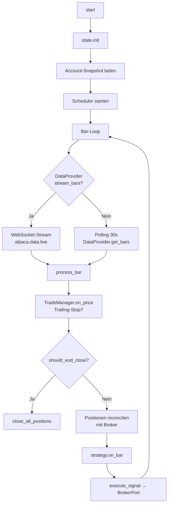

# Live-Betrieb

## Tagesablauf

```mermaid
gantt
    title Tagesablauf FluxTrader (Eastern Time)
    dateFormat HH:mm
    axisFormat %H:%M

    section Premarket
    Premarket-Scan (Gap-Scanner)   :09:00, 5m

    section Market
    Market Open (Bar-Loop startet) :09:30, 390m

    section EOD
    EOD-Close (Positionen flatten)  :15:27, 3m
    Post-Market (Daily Summary)     :16:05, 5m
```



## LiveRunner

Der `LiveRunner` orchestriert den gesamten Handels-Tag:



## Scheduler

Der `TradingScheduler` läuft auf APScheduler CronTrigger (Mon–Fri, ET):

| Event | Default-Uhrzeit | Callback |
|---|---|---|
| `premarket_scan` | 09:00 | Gap-Scanner, Telegram-Alert |
| `market_open` | 09:30 | Strategie/TradeManager Reset |
| `eod_close` | 15:27 | `close_all_positions()` |
| `post_market` | 16:05 | Daily-Summary an Telegram |

Zeiten in der Config anpassbar:

```yaml
strategy:
  params:
    premarket_time: "09:00"
    market_open_time: "09:30"
    eod_close_time: "15:27"
    post_market_time: "16:05"
```

## Premarket Gap-Scanner

```yaml
strategy:
  params:
    scanner_min_gap: 0.02       # Mindest-Gap 2%
    scanner_max_gap: 0.10       # Max-Gap 10%
    scanner_min_vol: 50000      # Mindest-Premarket-Volume
    auto_add_scanned: false     # Gefundene Symbole zur Watchlist hinzufügen?
```

Der Scanner nutzt die Alpaca Snapshot-API und sendet ein Telegram-Alert
mit den Top-Gap-Kandidaten.

## State-Persistenz (zentrale Multi-Bot-DB)

`PersistentState` speichert in `fluxtrader_data/state.db` (SQLite) – **eine DB für alle Bots**:

| Tabelle | Diskriminator | Zweck |
|---------|---|---|
| **trades** | strategy | Komplette Trade-Historie (entry_ts, exit_ts, pnl, mit_qty_factor, ev_estimate, features_json) |
| **equity_snapshots** | (ts, strategy) | Hochfrequente Equity-Kurve (pro Bar-Tick) |
| **positions** | (strategy, symbol) | Offene Positionen (Live-Spiegel mit unrealized_pnl) |
| **signals** | strategy | Eingegangene Signale (optional, für ML-Retraining) |
| **anomaly_events** | strategy | Erkannte Anomalien (Duplicate, Oversized, Spike, Connectivity, Flood) |
| **daily** | (day, strategy) | Tägliche Aggregates (pnl, trades_count, by_symbol) |
| **account** | key | Peak-Equity, globale Meter |
| **cooldowns** | symbol | Symbol-Cooldowns (Restart-persistent) |
| **reserved_groups** | (group_name, day, strategy) | MIT-Independence-Gruppen (pro Strategie/Tag) |

**Überleben eines Restarts:**
- Daily-PnL und Trade-Counter pro Strategie bleiben erhalten
- Offene Positionen + ihr Unrealized-PnL werden nach Restart neu aus Broker gelesen + DB aktualisiert
- Reservierte MIT-Korrelationsgruppen bleiben erhalten (kein Doppel-Entry nach Restart)
- Cooldowns bleiben erhalten
- **Neu:** Komplette Trade-Historie mit MIT-Qty-Factor + EV-Estimates bleibt für Probabilistische Auswertungen erhalten

### Datenfluss zur DB

```
LiveRunner.on_bar(bar)
├─ strategy.on_bar(bar) → Signal(features, strength, metadata)
├─ broker.execute_signal(sig) → ExecutionResult
├─ TradeManager.register_and_persist(trade, sig)
│  ├─ state.save_trade(...)  ← trades table (open, mit_qty_factor, ev_estimate)
│  └─ state.update_or_create_position(...)  ← positions table
├─ state.save_signal(sig)  ← signals table (für ML-Retraining)
├─ state.save_equity_snapshot(...)  ← equity_snapshots (alle 1–5 Min je nach Datendichte)
└─ (bei Close oder EOD)
   ├─ state.close_trade(...)  ← trades table (set exit_ts, pnl, realized-flag)
   ├─ state.remove_position(...)  ← positions table (delete)
   ├─ state.update_daily_record(...)  ← daily table (inkrementiert pnl + trades_count)
   └─ AnomalyDetector._emit(event)
      └─ state.log_anomaly(event)  ← anomaly_events table
```

### Beispiel: Trade in DB mit MIT + EV

```sql
SELECT id, symbol, entry_price, exit_price, pnl, mit_qty_factor, ev_estimate, group_name
FROM trades WHERE strategy='orb' AND symbol='AAPL' ORDER BY entry_ts DESC LIMIT 1;
```

Zeigt z.B.:
```
id | symbol | entry_price | exit_price | pnl    | mit_qty_factor | ev_estimate | group_name
---|--------|-------------|------------|--------|----------------|-------------|----------
42 | AAPL   | 150.25      | 152.10     | 18.50  | 0.75           | 0.42        | TECH_1
```

**Probabilistische Nutzung:**
- `mit_qty_factor`: Adjusted Trade-Größe aus MIT-Overlay (0.25–1.0) – für Law-of-Large-Numbers
- `ev_estimate`: Expected-Value des Signals – für Kelly-Criterion / Optimal-F-Calculation
- `group_name`: MIT-Independence-Gruppe – für Trade-Correlation-Analysen
- `features_json`: kompletter FeatureVector – für ML-Model-Retraining (offline)

## Telegram-Alerts

```yaml
notifications:
  enabled: true
  bot_name: "Flux_OBB"  # Wichtig wenn mehrere Bots in denselben Chat senden
  telegram_token: ""    # Besser via .env
  telegram_chat_id: ""  # Besser via .env
```

Alert-Typen:

| Event | Alert-Inhalt |
|---|---|
| Trade geöffnet | Bot-Name, Symbol, Side, Qty, Entry, Stop, Target, Reason, Order-Kontext |
| Trade geschlossen | Symbol, Exit-Preis, PnL, Reason (SL/TP/EOD) |
| Fehler | Komponente + Fehlermeldung |
| Daily Summary | Tag, PnL, Trade-Count, Equity |
| Premarket-Gaps | Top-Kandidaten mit Gap% und Volume |

## Produktions-Checkliste

!!! check "Vor dem ersten Live-Lauf"
    - [ ] `.env` mit **Live-API-Keys** (nicht Paper-Keys!)
    - [ ] `broker.paper: false` in der Config
    - [ ] `alpaca_data_feed: sip` für Real-Time-Daten
    - [ ] `notifications.enabled: true` + Telegram-Credentials
    - [ ] Einmalig Paper-Trading eine Woche lang testen
    - [ ] `initial_capital` dem tatsächlichen Kontoguthaben anpassen
    - [ ] `risk_pct` und `max_equity_at_risk` konservativ starten (0.5% / 2%)
    - [ ] TWS/Gateway läuft und API ist aktiviert (für IBKR)

## Graceful Shutdown

Der Runner registriert `SIGINT` / `SIGTERM`-Handler:

```bash
# Ctrl+C → ordentliches Stoppen
^C
2025-03-12 15:30:00 [info] runner.stopping
2025-03-12 15:30:02 [info] eod_close attempted=['NVDA'] remaining=[]
```

Offene Positionen werden **nicht** automatisch geschlossen bei einem Shutdown
außerhalb des EOD-Fensters – das ist eine bewusste Design-Entscheidung
(manuelles Schließen gewünscht oder Bot-Restart).

## Log-Monitoring

```bash
# Strukturierte Logs in Datei + JSON (für Aggregation z.B. Loki/Grafana)
python main.py live --config configs/orb_live.yaml --log-json 2>&1 | tee bot.log

# Nur Errors anzeigen
python main.py live --config configs/orb_live.yaml | grep '"level":"error"'
```

## Monitoring & Dashboard

Health-Server, Prometheus-Metrics, Web-Dashboard und Anomaly-Detection sind
eine eigene Subsystem-Ebene – siehe [monitoring.md](monitoring.md).

Wichtige Dashboard-Funktionen (lesen read-only aus der zentralen DB):
- **Trade-History:** `/api/trades?strategy=orb&since=2026-04-15` (mit MIT-Qty + EV)
- **Live-Positionen:** `/api/positions?strategy=orb` (Unrealized-PnL live)
- **Equity-Kurven:** `/api/equity?strategy=orb&limit=500` (für Charts)
- **Bot-Status:** `/api/strategies/list` (aggregierter Status aller Bots)

## Mehrere Bot-Instanzen

Jede Instanz braucht eine eigene `ibkr_client_id`. Alpaca-Konten können
mehrere Instanzen parallel nutzen (gleiches Key-Pair), solange Position-Limits
beachtet werden.

```yaml
# Bot-Instanz 1
broker:
  ibkr_client_id: 1
  ibkr_bot_id: ORB1

# Bot-Instanz 2 (anderer Config-File)
broker:
  ibkr_client_id: 2
  ibkr_bot_id: OBB1
```
