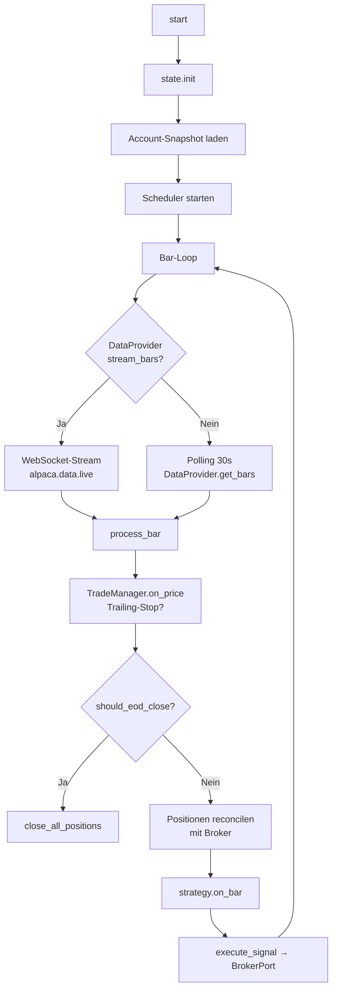

# Live-Betrieb

## Tagesablauf

```mermaid
gantt
    title Tagesablauf FluxTrader (Eastern Time)
    dateFormat HH:mm
    axisFormat %H:%M

    section Premarket
    Premarket-Scan (Gap-Scanner)   :09:00, 5m

    section Market
    Market Open (Bar-Loop startet) :09:30, 390m

    section EOD
    EOD-Close (Positionen flatten)  :15:27, 3m
    Post-Market (Daily Summary)     :16:05, 5m
```



## LiveRunner

Der `LiveRunner` orchestriert den gesamten Handels-Tag:



## Scheduler

Der `TradingScheduler` läuft auf APScheduler CronTrigger (Mon–Fri, ET):

| Event | Default-Uhrzeit | Callback |
|---|---|---|
| `premarket_scan` | 09:00 | Gap-Scanner, Telegram-Alert |
| `market_open` | 09:30 | Strategie/TradeManager Reset |
| `eod_close` | 15:27 | `close_all_positions()` |
| `post_market` | 16:05 | Daily-Summary an Telegram |

Zeiten in der Config anpassbar:

```yaml
strategy:
  params:
    premarket_time: "09:00"
    market_open_time: "09:30"
    eod_close_time: "15:27"
    post_market_time: "16:05"
```

## Premarket Gap-Scanner

```yaml
strategy:
  params:
    scanner_min_gap: 0.02       # Mindest-Gap 2%
    scanner_max_gap: 0.10       # Max-Gap 10%
    scanner_min_vol: 50000      # Mindest-Premarket-Volume
    auto_add_scanned: false     # Gefundene Symbole zur Watchlist hinzufügen?
```

Der Scanner nutzt die Alpaca Snapshot-API und sendet ein Telegram-Alert
mit den Top-Gap-Kandidaten.

## State-Persistenz

`PersistentState` speichert in `fluxtrader_data/state.db` (SQLite):

```
daily          │ day TEXT PK │ pnl REAL │ trades_count INT │ by_symbol JSON
account        │ key TEXT PK │ value REAL
cooldowns      │ symbol TEXT PK │ until_ts TEXT
reserved_groups│ group_name TEXT │ day TEXT │ PRIMARY KEY(group_name, day)
```

**Überleben eines Restarts:**
- Daily-PnL und Trade-Counter bleiben erhalten
- Reservierte MIT-Korrelationsgruppen bleiben erhalten (kein Doppel-Entry nach Restart)
- Cooldowns bleiben erhalten

## Telegram-Alerts

```yaml
notifications:
  enabled: true
  bot_name: "Flux_OBB"  # Wichtig wenn mehrere Bots in denselben Chat senden
  telegram_token: ""    # Besser via .env
  telegram_chat_id: ""  # Besser via .env
```

Alert-Typen:

| Event | Alert-Inhalt |
|---|---|
| Trade geöffnet | Bot-Name, Symbol, Side, Qty, Entry, Stop, Target, Reason, Order-Kontext |
| Trade geschlossen | Symbol, Exit-Preis, PnL, Reason (SL/TP/EOD) |
| Fehler | Komponente + Fehlermeldung |
| Daily Summary | Tag, PnL, Trade-Count, Equity |
| Premarket-Gaps | Top-Kandidaten mit Gap% und Volume |

## Produktions-Checkliste

!!! check "Vor dem ersten Live-Lauf"
    - [ ] `.env` mit **Live-API-Keys** (nicht Paper-Keys!)
    - [ ] `broker.paper: false` in der Config
    - [ ] `alpaca_data_feed: sip` für Real-Time-Daten
    - [ ] `notifications.enabled: true` + Telegram-Credentials
    - [ ] Einmalig Paper-Trading eine Woche lang testen
    - [ ] `initial_capital` dem tatsächlichen Kontoguthaben anpassen
    - [ ] `risk_pct` und `max_equity_at_risk` konservativ starten (0.5% / 2%)
    - [ ] TWS/Gateway läuft und API ist aktiviert (für IBKR)

## Graceful Shutdown

Der Runner registriert `SIGINT` / `SIGTERM`-Handler:

```bash
# Ctrl+C → ordentliches Stoppen
^C
2025-03-12 15:30:00 [info] runner.stopping
2025-03-12 15:30:02 [info] eod_close attempted=['NVDA'] remaining=[]
```

Offene Positionen werden **nicht** automatisch geschlossen bei einem Shutdown
außerhalb des EOD-Fensters – das ist eine bewusste Design-Entscheidung
(manuelles Schließen gewünscht oder Bot-Restart).

## Log-Monitoring

```bash
# Strukturierte Logs in Datei + JSON (für Aggregation z.B. Loki/Grafana)
python main.py live --config configs/orb_live.yaml --log-json 2>&1 | tee bot.log

# Nur Errors anzeigen
python main.py live --config configs/orb_live.yaml | grep '"level":"error"'
```

## Mehrere Bot-Instanzen

Jede Instanz braucht eine eigene `ibkr_client_id`. Alpaca-Konten können
mehrere Instanzen parallel nutzen (gleiches Key-Pair), solange Position-Limits
beachtet werden.

```yaml
# Bot-Instanz 1
broker:
  ibkr_client_id: 1
  ibkr_bot_id: ORB1

# Bot-Instanz 2 (anderer Config-File)
broker:
  ibkr_client_id: 2
  ibkr_bot_id: OBB1
```
