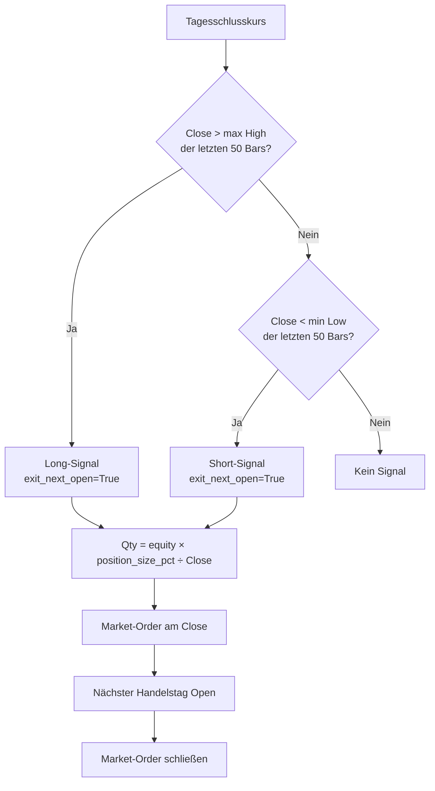

# OBB – One Bar Breakout

Die OBB-Strategie handelt Ausbrüche auf Daily-Bars: Schließt ein Bar über dem
50-Tage-Hoch (oder unter dem 50-Tage-Tief), wird am Close eingestiegen und am
nächsten Open wieder geschlossen. **Keine Stop-Loss, keine Take-Profit-Order.**

## Funktionsprinzip



!!! info "Lookahead-Bias-Schutz"
    Das Rolling-High/Low berechnet sich mit `shift(1)` – der aktuelle Bar ist
    aus dem Lookup ausgeschlossen. Kein Lookahead-Bias.

---

## Benötigte Daten

| Quelle | Timeframe | Wozu |
|---|---|---|
| **Handelssymbol** | `1Day` | Rolling-High/Low (50 Bars), Breakout-Signal, Sizing |

**Mindest-History:** `lookback_bars + 5` abgeschlossene Handelstage — bei Default 50 Bars also
**mindestens ~55 tägliche Bars** im Buffer. Config-Default `lookback_days: 90` stellt das sicher.

!!! warning "Kein Filter-Stack"
    OBB hat bewusst keinen Trend-, Gap- oder VIX-Filter. Die Strategie setzt auf statistische
    Häufigkeit von Momentum-Followthrough nach neuen 50-Tage-Extremen und filtert durch
    Positionsgröße statt durch Bedingungen.

---

## Parameter-Referenz

| Parameter | Default | Beschreibung |
|---|---|---|
| `lookback_bars` | `50` | Anzahl historischer Bars für Rolling H/L |
| `allow_shorts` | `true` | Short-Seite handeln |
| `position_size_pct` | `0.10` | Eigenkapitalanteil pro Position (10%) |
| `use_kelly_sizing` | `false` | Experimentell: Kelly statt Fixed-Fraction |
| `kelly_fraction` | `0.50` | Half-Kelly wenn aktiviert |
| `kelly_payoff_ratio` | `1.0` | Reward/Risk für Kelly-Berechnung |
| `max_daily_trades` | `3` | Maximal N Entries pro Tag |
| `max_concurrent_positions` | `10` | Maximal N gleichzeitige Positionen |

---

## Stop-Loss & Exit

OBB handelt bewusst **ohne Stop-Loss**. Das maximale Verlust-Risiko ist auf
`position_size_pct × equity` begrenzt (Default: 10% pro Position).

Der Exit erfolgt am nächsten Open via `exit_next_open`-Flag im Signal-Metadata:

```python
Signal(
    metadata={
        "exit_next_open": True,   # TradeManager schließt am nächsten Bar-Open
        "qty_hint": 250,           # Berechnete Stückzahl
        ...
    }
)
```

Der `TradeManager` (Backtest) und `LiveRunner` reagieren auf dieses Flag und
platzieren am nächsten Market-Open eine Schließ-Order.

---

## Sizing

```
qty = int( equity × position_size_pct / close_price )
```

Beispiel bei 100.000 $ Eigenkapital, 10% pro Position, Close = 250 $:
```
qty = int(100.000 × 0.10 / 250) = 40 Aktien
```

---

## Minimal-Config

```yaml
strategy:
  name: obb
  symbols: [SPY, QQQ, IWM, AAPL, MSFT, NVDA, TSLA]
  risk_pct: 0.01
  params:
    lookback_bars: 50
    allow_shorts: true
    position_size_pct: 0.10

data:
  timeframe: "1Day"
  lookback_days: 90
```

!!! warning "Daily-Bars"
    OBB benötigt Daily-Bars (`timeframe: "1Day"`). Mit 5-Min-Bars liefert
    die Strategie keine sinnvollen Signale.

---

## Overnight-Risiko

OBB hält Positionen **über Nacht** und verzichtet bewusst auf Stop-Loss-Orders. Das maximale
Verlustrisiko pro Position beträgt `position_size_pct × equity` (Default 10%), aber:

- **Gap-Risiko:** Earnings, Makro-Events und Geopolitik können den nächsten Open weit von
  der Einstiegsposition entfernen. Das tatsächliche Verlustrisiko kann `position_size_pct`
  deutlich übersteigen.
- **Geeignete Symbole:** Nur hochliquide Titel (SPY, QQQ, large-cap) verwenden.
  Penny Stocks oder News-sensitive Einzeltitel erhöhen das Gap-Risiko massiv.
- **Keine automatische Absicherung:** Kein Hedge, kein Bracket. Der Exit erfolgt
  ausschließlich als Market-Order am nächsten Open.

---

## Live-Betrieb

OBB hält Positionen über Nacht. Im Gegensatz zu ORB darf **kein EOD-Flatten**
stattfinden. Der LiveRunner unterstützt das generisch über die Config-Zeitsteuerung:

```yaml
strategy:
  params:
    timeframe: "1Day"
    eod_close_time: null
    premarket_time: null
    market_open_time: "09:15"      # Exit-Fenster (OPG)
    post_market_time: "16:05"
    poll_interval_s: 300

    obb_entry_cutoff_time: "15:59" # keine neuen Entries nach Cutoff
    obb_close_time: "16:00"        # harte Sperre nach Börsenschluss
    obb_exit_open_time: "09:15"    # OPG-Exit ab dieser Zeit
    obb_entry_time_in_force: "cls" # Closing-Auction Entry
    obb_exit_time_in_force: "opg"  # Opening-Auction Exit
```

**Tagesablauf OBB (Eastern Time):**

| Uhrzeit | Event | Beschreibung |
|---|---|---|
| 09:15 | Open-Exit-Fenster | `exit_next_open`-Positionen als OPG schließen |
| 16:00+ | Daily Bar verfügbar | Strategie wertet aus, ggf. Entry |
| 16:05 | Post-Market | Daily Summary an Telegram |
| Über Nacht | Position gehalten | Kein EOD-Close, kein Trailing |

**Wichtig:**

- `eod_close_time: null` deaktiviert Scheduler-EOD-Close und TradeManager-EOD-Check.
- Entries werden als Closing-Auction-Orders vor Close gesendet (`CLS`/`MOC`).
- Nach `obb_close_time` werden neue OBB-Entries strikt verworfen.
- `exit_next_open` wird im konfigurierten Open-Fenster als `OPG` ausgeführt.
- Bei Bot-Restart bleiben Broker-Positionen offen. Der `market_open`-Callback
  schließt nur Positionen, die in der aktuellen Session als `exit_next_open`
  registriert wurden.

---

## Unterschiede zu ORB

| Aspekt | ORB | OBB |
|---|---|---|
| Timeframe | 5-Min | Daily |
| Haltedauer | Intraday (Stunden) | 1 Handelstag |
| Stop-Loss | ORB-Range-basiert | Keiner |
| Take-Profit | 2R (konfigurierbar) | Keiner |
| Filter-Stack | Gap, Trend, MIT, VIX | Keiner |
| Sizing | R-basiert + Kelly | Fixed-Fraction |
| Entry-Zeit | Nach 10:00 ET | Close des Breakout-Bars |
| Exit-Zeit | Intraday SL/TP/EOD | Nächster Open |
