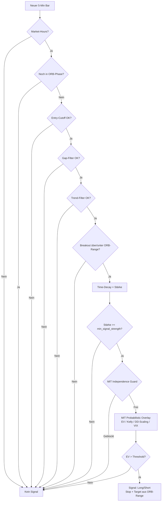

# ORB – Opening Range Breakout

Die ORB-Strategie handelt Ausbrüche aus der Opening Range (9:30–10:00 ET) mit
einem mehrstufigen Filter-Stack und optionalem MIT Probabilistic Overlay.

## Funktionsprinzip



---

## Parameter-Referenz

### Opening Range

| Parameter | Default | Beschreibung |
|---|---|---|
| `opening_range_minutes` | `15` | Dauer der Opening Range ab 9:30 ET |
| `orb_breakout_multiplier` | `1.15` | Preis muss ORB-High/Low × Faktor überschreiten |
| `volume_multiplier` | `1.7` | Mindest-Volume-Ratio vs. Time-of-Day-MA |
| `min_signal_strength` | `0.25` | Mindest-Signalstärke (0–1) nach Decay |

### Risk / Sizing

| Parameter | Default | Beschreibung |
|---|---|---|
| `stop_loss_r` | `1.0` | Stop = ORB-Range × Faktor (Long: unterhalb ORB-Low) |
| `profit_target_r` | `2.0` | Target = Entry + 2R (1R = Entry-Stop-Distanz) |
| `trail_after_r` | `1.0` | Trailing-Stop aktiviert ab X × R Gewinn |
| `trail_distance_r` | `0.6` | Trailing-Abstand in R-Multiples |

### Richtungsfilter

| Parameter | Default | Beschreibung |
|---|---|---|
| `allow_shorts` | `true` | Short-Seite handeln |
| `avoid_fridays` | `false` | Freitags keine Entries |
| `avoid_mondays` | `false` | Montags keine Entries |

### Zeitfenster

| Parameter | Default | Beschreibung |
|---|---|---|
| `market_open` | `09:30` | Market-Open ET |
| `market_close` | `16:00` | Market-Close ET |
| `orb_end_time` | `10:00` | Ende der ORB-Phase |
| `eod_close_time` | `15:27` | Spätester EOD-Close ET |
| `entry_cutoff_time` | `null` | Kein Entry nach dieser Uhrzeit (null = deaktiviert) |

### Trend-Filter

| Parameter | Default | Beschreibung |
|---|---|---|
| `use_trend_filter` | `true` | SPY EMA-Trendfilter aktivieren |
| `trend_ema_period` | `20` | EMA-Periode für SPY-Trend |

### Gap-Filter

| Parameter | Default | Beschreibung |
|---|---|---|
| `use_gap_filter` | `true` | Gap-Filter aktivieren |
| `max_gap_pct` | `0.03` | Maximaler erlaubter Gap (3%) |

### Time-Decay

| Parameter | Default | Beschreibung |
|---|---|---|
| `use_time_decay_filter` | `true` | Signalstärke mit zunehmender Tageszeit reduzieren |
| `time_decay_brackets` | `[[30,1.0],[90,0.85],[180,0.65]]` | Minuten nach ORB-End → Faktor |
| `time_decay_late_factor` | `0.40` | Faktor nach dem letzten Bracket |

### MIT Probabilistic Overlay

| Parameter | Default | Beschreibung |
|---|---|---|
| `use_mit_probabilistic_overlay` | `true` | MIT-Overlay aktivieren |
| `mit_ev_threshold_r` | `0.30` | Mindest-Expected-Value in R |
| `mit_kelly_fraction` | `0.50` | Half-Kelly (50% des vollen Kelly) |
| `mit_min_strength` | `0.25` | Mindest-Stärke für MIT-Bewertung |
| `mit_calibration_offset` | `0.0317` | Kalibrierungs-Offset für Win-Prob-Schätzung |
| `use_dynamic_kelly_dd_scaling` | `true` | Kelly mit Drawdown skalieren |
| `dynamic_kelly_max_dd` | `0.15` | Ab 15% DD → Kelly = 0 |
| `use_mit_independence_guard` | `true` | Korrelationsgruppen blockieren |

### MIT Korrelationsgruppen

```yaml
mit_correlation_groups:
  index_etfs:        [SPY, QQQ, IWM, DIA]
  semi_ai:           [NVDA, AMD, AVGO]
  mega_cap_tech:     [AAPL, MSFT, META, AMZN, GOOGL]
  high_beta_growth:  [TSLA, PLTR, NFLX]
```

Pro Gruppe darf nur ein Symbol gleichzeitig eine offene Position haben.

### VIX Term-Structure Regime

| Parameter | Default | Beschreibung |
|---|---|---|
| `use_vix_term_structure` | `true` | VIX-Regime-Filter aktivieren |
| `vix_regime_flat_lower` | `0.90` | VIX/VIX3M < dieser Wert → Contango (bullish) |
| `vix_regime_flat_upper` | `1.00` | Normal-Zone Obergrenze |
| `vix_regime_backwd_upper` | `1.15` | > 1.15 → extreme Backwardation → Long-Entries blockiert |

---

## Stopp-Berechnung

```
Long:  stop = max(orb_low,  entry - stop_loss_r × orb_range)
Short: stop = min(orb_high, entry + stop_loss_r × orb_range)
```

Fallback wenn Stop auf der falschen Seite des Entry liegt:
```
stop = entry ± 0.5 × orb_range
```

---

## MIT Win-Probability-Schätzung

Die Win-Wahrscheinlichkeit wird heuristisch aus mehreren Faktoren geschätzt:

```
p = 0.40  (Base)
  + 0.25 × strength
  + 0.04 × clip(volume_ratio - 1, 0, 1.5)
  + 0.03  (wenn volume_confirmed)
  + 0.03  (wenn 0.25% ≤ orb_range_pct ≤ 1.20%)
  + 0.03  (wenn Trend ausgerichtet)
  - 0.05  (wenn Trend gegenläufig)
  + calibration_offset
```

Ergebnis wird auf [0.20, 0.80] geclippt.

---

## Minimal-Config (ORB ohne Overlay)

```yaml
strategy:
  name: orb
  symbols: [SPY, QQQ, NVDA]
  risk_pct: 0.01
  params:
    opening_range_minutes: 15
    allow_shorts: true
    use_mit_probabilistic_overlay: false
    use_trend_filter: false
    use_gap_filter: false
    eod_close_time: "15:27"
```
