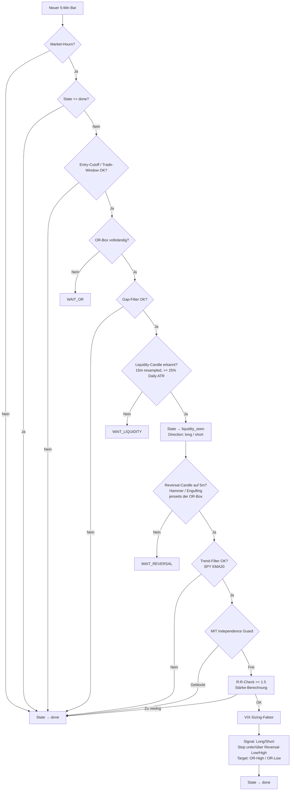

# Quick Flip – Reversal nach Liquidity-Sweep

Quick Flip ist ein regelbasierter Intraday-Scalper. Die Strategie sucht nach einem
institutionellen Stop-Hunt über oder unter der Opening-Range-Box und tradet die
anschließende Gegenbewegung, sobald ein Reversal-Candlestick-Pattern erscheint.

Die Kernidee: Institutionelle Akteure treiben den Preis vor der Opening Range kurz über
ein offensichtliches Level (Stop-Hunt / Liquidity-Sweep), um dann in die Gegenrichtung zu
beschleunigen. Quick Flip wartet auf diese Sequenz und steigt nach dem Sweep ein.

Registriert als `"quick_flip"`.

---

## Funktionsprinzip



---

## Benötigte Daten

| Quelle | Timeframe | Wozu |
|---|---|---|
| **Handelssymbol** (z.B. SPY, NVDA) | 5-Min | OR-Box, Liquidity-Candle (auf 15m resampled), Reversal-Pattern |
| **SPY** (via `MarketContextService.spy_df`) | 5-Min | Trend-Filter: SPY > EMA20 → bullish |
| **VIX** (via `MarketContextService.vix`) | Snapshot | Positions-Sizing-Reduktion bei VIX > 30 |
| **Daily ATR** | täglich (aus 5m resampelt) | Liquidity-Candle-Schwelle: Range >= 25% Daily ATR |

Für Live: `provider: ibkr`, `timeframe: "5Min"`, `lookback_days: 30` (Daily ATR(14) braucht ≥14 abgeschlossene Tage).
Für Backtest: `provider: yfinance`, `timeframe: "5Min"`, `lookback_days: 60`.

**Mindest-Warmup:** `min_bars: 120` (Default Live) — stellt sicher, dass Daily ATR(14) aus resampelten 5m-Bars korrekt berechnet wird.

---

## Handelszeiten / Tagesablauf

Quick Flip ist eine **reine Intraday-Strategie** — alle Positionen werden innerhalb der Session geschlossen.

| Uhrzeit ET | Event |
|---|---|
| 09:30 | Market-Open — OR-Phase beginnt, kein Trade-Entry |
| 09:30–09:45 | Opening Range wird aufgebaut (15 Min, konfigurierbar) |
| ab 09:45 | OR-Box steht — State wechselt zu `or_locked`, Gap-Check läuft |
| ab 09:45 | Liquidity-Candle-Scan auf 15m-Chart (resampled aus 5m) |
| nach Liquidity | Reversal-Candle-Scan auf 5m-Chart jenseits der OR-Box |
| bis 10:45 | Entry-Cutoff — kein neuer Trade-Entry danach (`entry_cutoff_time`) |
| bis 11:00 | Trade-Window-Ende — 90 Min nach Open (`max_trade_window_minutes`) |
| Intraday | Position läuft bis SL, TP oder manuellem Exit |

**Wichtig:**
- Pro Tag und Symbol **maximal ein Trade** — nach dem ersten Signal wechselt der State zu `done`.
- `max_trade_window_minutes: 90` begrenzt das Zeitfenster auf 09:30–11:00 ET.
- Kein automatisches EOD-Flatten konfiguriert — der TradeManager übernimmt via SL/TP.

---

## State Machine

Quick Flip nutzt eine explizite State Machine pro Tag (Vorlage für sequenzielle Strategien im Framework):

| State | Bedeutung | Übergang zu |
|---|---|---|
| `idle` | OR-Phase läuft noch | `or_locked` sobald OR-Box vollständig |
| `or_locked` | OR-Box steht, warte auf Liquidity-Candle | `liquidity_seen` bei Fund |
| `liquidity_seen` | Liquidity erkannt, warte auf Reversal-Candle | `done` bei Signal oder Timeout |
| `done` | Terminal für den Tag — kein weiterer Trade | — |

---

## Filter-Stack

| Filter | Parameter | Wirkung |
|---|---|---|
| **Gap-Filter** | `max_gap_pct: 0.03` | Kein Trade wenn Open > 3% von Vortags-Close entfernt |
| **Trend-Filter** | `trend_ema_period: 20` | SPY > EMA20 → bullish erlaubt; SPY < EMA20 → nur shorts |
| **Liquidity-Candle** | `liquidity_atr_threshold: 0.25` | 15m-Bar-Range ≥ 25% Daily ATR14 → Sweep-Signal |
| **Reversal-Pattern** | Hammer / Engulfing | Bestätigung der Richtungsumkehr auf 5m |
| **R:R-Filter** | `min_rr_ratio: 1.5` | Trade wird verworfen wenn Reward/Risk < 1.5 |
| **VIX-Regime** | `vix_high_threshold: 30` | Positionsgröße halbiert bei VIX > 30 |
| **MIT Independence Guard** | `mit_correlation_groups` | Max. 1 offene Position pro Korrelationsgruppe |
| **Entry-Cutoff** | `entry_cutoff_time: "10:45"` | Kein neuer Entry nach 10:45 ET |
| **Trade-Window** | `max_trade_window_minutes: 90` | Kein neuer Entry > 90 Min nach Open |

---

## Entry / Stop / Target

```
Long-Setup (nach bearischem Sweep unter OR-Low):
  entry  = Close des Reversal-Bars
  stop   = Bar-Low − buffer_ticks (Default: $0.05)
  target = OR-High

Short-Setup (nach bullischem Sweep über OR-High):
  entry  = Close des Reversal-Bars
  stop   = Bar-High + buffer_ticks
  target = OR-Low
```

Der R:R-Check wird nach Berechnung von Entry/Stop/Target ausgeführt. Bei `rr_ratio < min_rr_ratio`
wird kein Signal erzeugt.

---

## Signal-Stärke

```
strength = clip(0.35 + 0.10 × (rr_ratio − min_rr) + engulfing_bonus, 0.0, 1.0)
engulfing_bonus = +0.10 bei bullish_engulfing / bearish_engulfing (vs. Hammer)
```

Mindest-Stärke für Signalausgabe: `min_signal_strength: 0.35`.

---

## Sizing

R-basiert via `position_size(equity, risk_pct, entry, stop)`:

```
base_qty = equity × risk_pct / |entry − stop|
final_qty = base_qty × vix_factor × qty_factor
```

- `risk_per_trade: 0.005` — 0.5% Equity-Risiko je Trade
- `vix_factor: 0.5` bei VIX > 30, sonst 1.0
- `qty_factor: 1.0` (MIT-Overlay-Platzhalter, derzeit neutral)

---

## Candlestick-Parameter

| Parameter | Default | Beschreibung |
|---|---|---|
| `hammer_shadow_ratio` | `2.0` | Min. unterer Schatten als Vielfaches des Body |
| `hammer_upper_shadow_ratio` | `0.3` | Max. oberer Schatten als Anteil des Body |
| `engulfing_min_body_ratio` | `0.6` | Min. Body-Größe der Engulfing-Candle relativ zum Vorgänger |

---

## MIT Korrelationsgruppen

```yaml
mit_correlation_groups:
  index_etfs:      [SPY, QQQ, IWM, DIA]
  semi_ai:         [NVDA, AMD, AVGO]
  mega_cap_tech:   [AAPL, MSFT, META, AMZN, GOOGL]
```

Pro Gruppe darf nur ein Symbol gleichzeitig eine offene Position haben.

---

## Konfiguration

### Vollständige Parameter-Referenz

```yaml
strategy:
  name: quick_flip
  params:
    # Opening Range & Trade-Fenster
    opening_range_minutes: 15        # Länge der Opening-Range-Box in Minuten
    max_trade_window_minutes: 90     # Maximales Handelsfenster nach Open in Minuten
    entry_cutoff_time: "10:45"       # Kein neuer Trade-Entry nach dieser Uhrzeit ET

    # Liquidity Candle (Kern-Filter)
    liquidity_atr_threshold: 0.25    # Min. Candle-Range als Anteil der 14-Tage-ATR

    # Risk / Reward
    min_rr_ratio: 1.5                # Mindest-Risk-Reward-Ratio
    buffer_ticks: 0.05               # Stop-Puffer in $ jenseits Reversal-Candle-Extremum
    risk_per_trade: 0.005            # Risiko je Trade als Anteil der Equity (0.5 %)
    min_signal_strength: 0.35        # Mindeststärke des Signals (0–1) für Ausgabe

    # Richtungs-Steuerung
    allow_shorts: true               # Short-Trades erlauben

    # Trend / Gap
    use_trend_filter: true           # SPY-Trendfilter aktivieren (empfohlen)
    trend_ema_period: 20             # EMA-Periode für SPY-Trendfilter
    use_gap_filter: true             # Gap-Filter bei Marktöffnung aktivieren
    max_gap_pct: 0.03                # Maximaler Gap zur Vortagsclose in %

    # VIX-Regime
    use_vix_filter: true             # VIX-Regime-Filter aktivieren
    vix_high_threshold: 30.0         # Ab diesem VIX-Wert Position Size reduzieren
    vix_size_factor: 0.5             # Größen-Multiplikator bei hohem VIX

    # MIT Independence Overlay
    use_mit_overlay: true            # MIT-Independence-Overlay aktivieren
    mit_correlation_groups:
      index_etfs: [SPY, QQQ, IWM, DIA]
      semi_ai: [NVDA, AMD, AVGO]
      mega_cap_tech: [AAPL, MSFT, META, AMZN, GOOGL]

    # Candlestick-Parameter
    hammer_shadow_ratio: 2.0
    hammer_upper_shadow_ratio: 0.3
    engulfing_min_body_ratio: 0.6

    # Warmup / Buffer
    min_bars: 120                    # Minimale Bar-Anzahl im Buffer vor erstem Signal
    max_bars_buffer: 2000            # Max. Bar-Anzahl im Strategy-Buffer
```

### Quick-Start

```bash
# Live / Paper
python main.py paper --config configs/quick_flip.yaml
python main.py live  --config configs/quick_flip.yaml

# Backtest
PYTHONIOENCODING=utf-8 python main.py backtest --config configs/quick_flip_backtest.yaml
```

---

## Implementierung

```
strategy/quick_flip.py
  QuickFlipStrategy._generate_signals(bar)
    ├─ State-Machine: idle → or_locked → liquidity_seen → done
    ├─ _lock_opening_range(df_5m)        → or_high, or_low
    ├─ _compute_daily_atr(df_5m)         → daily_atr (14-Tage aus resampelten 5m)
    ├─ _detect_liquidity_candle(df_5m)   → 15m-Resample, is_liquidity_candle()
    └─ _detect_reversal_candle(df_5m)    → detect_reversal_pattern() + alle Filter + Signal

  _fresh_day_cache() → State-Reset täglich (date, state, or_high, or_low, ...)
```

!!! note "State-Machine-Vorlage"
    Quick Flip führt das explizite `_day_cache["state"]`-Pattern in FluxTrader ein.
    Bei 4+ sequenziellen Schritten ist implizites Cache-Key-Checking (wie in `orb.py`)
    fehleranfällig. Dieses Pattern dient als Vorlage für zukünftige sequenzielle Strategien.
